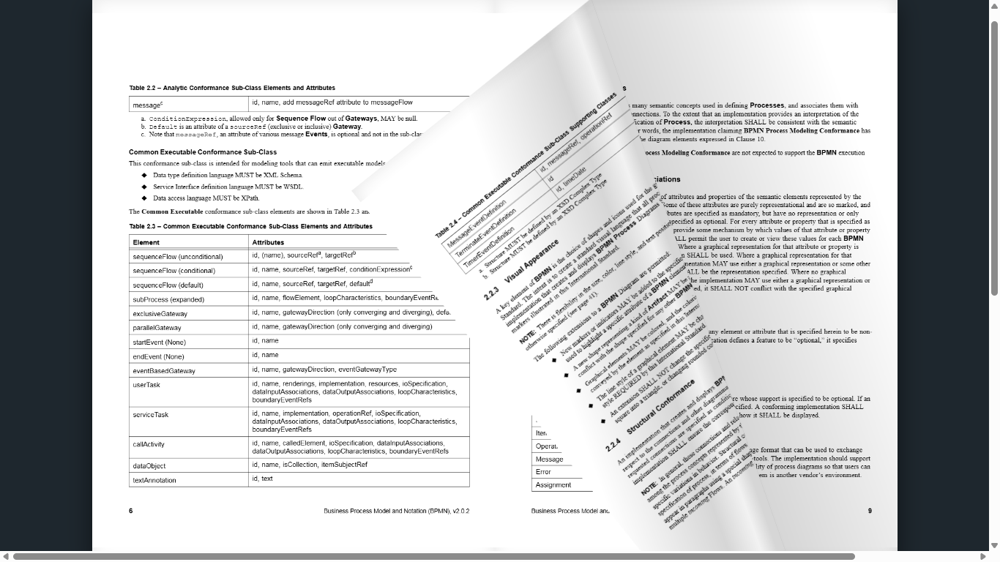

# 📖 Google Drive PDF Flipbook

Um visualizador de flipbooks interativo e moderno que permite carregar e folhear arquivos PDF diretamente de links públicos do **Google Drive**, utilizando **HTML5**, **JavaScript**, **PDF.js** e a biblioteca **PageFlip**.

## 📸 Prévia do Projeto



## 🚀 Funcionalidades

* **Integração com o Google Drive:** Abra qualquer PDF armazenado na sua nuvem apenas colando o link de compartilhamento público.
* **Proxy Python Inteligente:** Um servidor local em Python que contorna as restrições de CORS do navegador e trata automaticamente avisos de confirmação de segurança (arquivos grandes) do Google Drive.
* **Renderização de Alta Qualidade:** Utiliza o *PDF.js* da Mozilla para desenhar cada página em canvas de alta resolução.
* **Efeito de Virada de Página Realista:** Baseado na biblioteca *PageFlip*, oferecendo sombras dinâmicas, suporte a capas e navegação fluida.
* **Leve e Sem Complicação:** Não requer bancos de dados ou instalações complexas na nuvem.

## 🛠️ Tecnologias Utilizadas

* [**PDF.js**](https://mozilla.github.io/pdf.js/) — Leitura e renderização dos arquivos PDF no navegador.
* [**PageFlip**](https://nodus.com.ua/en/page-flip/) — Efeito físico e interativo de folhear páginas.
* **Python (http.server / urllib):** Servidor HTTP local e proxy para download seguro dos arquivos do Drive.
* **HTML5 / CSS3 / JavaScript (ES6+)**

## ⚙️ Como Executar o Projeto

### Passo 1: Preparar os arquivos
Certifique-se de que a sua pasta de projeto contém os seguintes arquivos:
* `index.html` (interface web e lógica de renderização)
* `server.py` (servidor Python e proxy para o Google Drive)
* `screenshot.png` (imagem de demonstração do projeto)

### Passo 2: Iniciar o servidor local
Abra o seu terminal (PowerShell ou Prompt de Comando) na pasta do projeto e execute:

```bash
python server.py